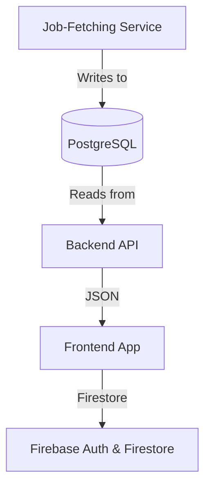

# Real-time Job Market Hub

## Overview
A full‑stack application that ingests job listings from external APIs, stores and analyses skill data, and presents insights through an interactive web interface for students and institutions.

This repository contains three main components:

1. **backend** – a Node.js/Express API in TypeScript connecting PostgreSQL and serving skill statistics.
2. **frontend** – a React + Vite single‑page app in TypeScript using Tailwind CSS, Shadcn UI and Recharts for data visualisation.
3. **job-fetching-service** – a Python service handling external job API ingestion, parsing, de‑duplication and ETL into PostgreSQL.

---

## Table of Contents

- [Architecture](#architecture)
- [Tech Stack](#tech-stack)
- [Getting Started](#getting-started)
  - [Prerequisites](#prerequisites)
  - [Installation & Configuration](#installation--configuration)
- [Directory Structure](#directory-structure)
- [Key Components](#key-components)
- [Usage](#usage)

---

## Architecture



1. **Job‑Fetching Service** pulls jobs via RapidAPI, normalises skills, upserts into PostgreSQL.
2. **Backend API** exposes REST endpoints for skill statistics and user data, merges PostgreSQL and Firestore profiles.
3. **Frontend App** displays dashboards, visualises trends, and writes user preferences to Firestore.

---

## Tech Stack

- **Backend**: Node.js, Express.js, TypeScript, PostgreSQL
- **Frontend**: React, Vite, TypeScript, Tailwind CSS, Shadcn UI, Recharts
- **ETL Pipeline**: Python (job‑fetching‑service), SQL upserts, skill normalisation
- **Auth & Profiles**: Firebase Authentication, Firestore

---

## Getting Started

### Prerequisites

- Node.js v18+
- Python 3.10+
- PostgreSQL database
- Firebase project (Authentication + Firestore)

### Installation & Configuration

1. **Clone the repo**
   ```bash
   git clone <repo-url>
   cd synoptic-project
   ```

2. **Environment variables**

   - Copy `.env.example` to each service directory and set keys:
     - **backend/.env**: `DATABASE_URL`, `FIREBASE_PROJECT_ID`, `FIREBASE_CLIENT_EMAIL`, `FIREBASE_PRIVATE_KEY`
     - **frontend/.env**: `VITE_FIREBASE_API_KEY`, `VITE_FIREBASE_AUTH_DOMAIN`, `VITE_API_BASE_URL`
     - **job-fetching-service/.env**: `RAPIDAPI_KEY`, `DATABASE_URL`

3. **Install dependencies**

   ```bash
   # Backend
   cd backend && npm install

   # Frontend
   cd ../frontend && npm install

   # Job‑fetching Service
   cd ../job-fetching-service && pip install -r requirements.txt
   ```

---

## Directory Structure

```
/ backend/
  ├── src/
  │   ├── routes/
  │   ├── services/
  │   └── app.ts
  └── tsconfig.json
/ frontend/
  ├── src/
  │   ├── components/
  │   ├── contexts/
  │   └── App.tsx
  └── vite.config.ts
/ job-fetching-service/
  ├── services/
  ├── models/
  └── main.py
```

---

## Key Components

### Backend

- **`SkillService.getSkillStatistics`** (`backend/src/services/skillService.ts`)
  - Core SQL query → maps rows to `SkillStatistics[]` → computes deltas.
- **Route Handler** (`backend/src/routes/skillRoutes.ts`)
  - `GET /statistics` endpoint, async/await, error handling, JSON envelope.

### Frontend

- **`SkillCard` Component** (`frontend/src/components/SkillCard.tsx`)
  - UI widget, slider control, local state, context callback.
- **`updateSkill`** (`frontend/src/contexts/UserContext.tsx`)
  - Persists user choice to Firestore, merges fields, handles async errors.

### Job‑Fetching Service

- **`fetch_jobs()`** (`job-fetching-service/services/job_fetcher.py`)
  - RapidAPI calls, pagination, rate‑limit logic.
- **`store_jobs()`** (`job-fetching-service/services/db_handler.py`)
  - Parses raw job data → upserts into PostgreSQL → commits.

---

## Usage

### Run Backend

```bash
cd backend
npm run build
npm start
```

### Run Frontend

```bash
cd frontend
npm run dev
```

### Run Job‑Fetching Service

```bash
cd job-fetching-service
python main.py
```

